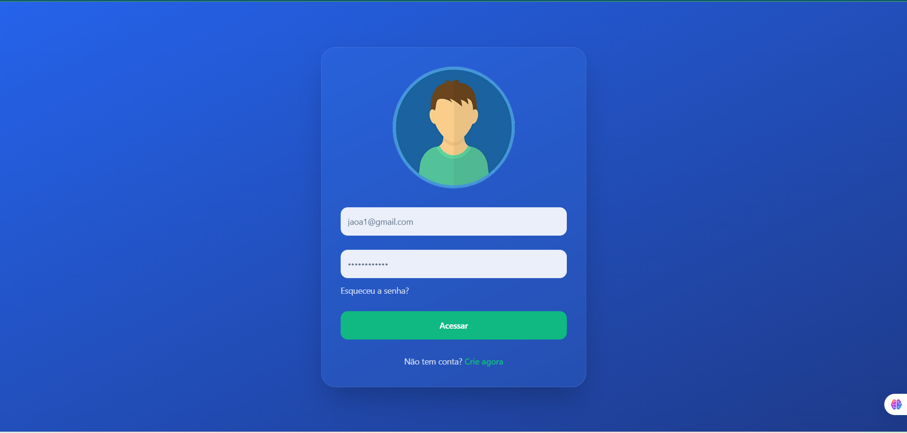

# 🏥 Projeto Telemedicina - SAÚDE

## 💡 Descrição

Este projeto tem como objetivo proporcionar **acesso facilitado à telemedicina** no estado do **Maranhão (MA)**. Desenvolvemos uma plataforma web informativa sobre telemedicina, com **sistema de agendamento de consultas** e **cadastro de pacientes**, promovendo inclusão digital e melhoria no acesso aos serviços de saúde, especialmente em regiões com difícil deslocamento ou pouca infraestrutura médica.

---

## ❗ Problemática

O acesso à saúde de qualidade ainda é um desafio em muitas regiões do Brasil, em especial no Maranhão. Com isso, a **telemedicina surge como uma solução viável**, permitindo que pacientes se conectem com profissionais de saúde remotamente. Este projeto propõe **uma plataforma acessível e intuitiva para facilitar esse processo**.

---

## 🌐 Funcionalidades

- Informações claras e acessíveis sobre o que é telemedicina
- Cadastro de usuários
- Agendamento de consultas online
- Interface responsiva e moderna

## 📁 Estrutura de Pastas

```
📦 projeto-telemedicina
├── node_modules/
├── public/
│   └── assets/
│       ├── cadastro.png
│       ├── favicon.png
│       ├── foto.png
│       ├── homemComLaptop.png
│       ├── placeholder.svg
│       ├── robots.txt
│       └── print.png              # <-- Imagem da interface
├── src/
│   ├── components/                # Componentes reutilizáveis
│   ├── contexts/                  # Context API (auth, tema etc.)
│   ├── hooks/                     # Hooks personalizados
│   ├── lib/                       # Utilitários ou integrações
│   ├── pages/                     # Páginas da aplicação
│   │   ├── Agendamento.tsx
│   │   ├── Dashboard.tsx
│   │   ├── ForgotPassword.tsx
│   │   ├── Index.tsx
│   │   ├── Login.tsx
│   │   ├── NotFound.tsx
│   │   └── Register.tsx
│   ├── App.tsx
│   ├── index.css
│   ├── main.tsx
│   └── vite-env.d.ts
├── .eslintrc.cjs
├── bun.lockb
├── components.json
├── index.html
├── package.json
├── package-lock.json
├── postcss.config.js
├── tailwind.config.ts
├── tsconfig.json
├── tsconfig.app.json
├── tsconfig.node.json
└── vite.config.ts
```

## 🛠️ Tecnologias Utilizadas

- [React](https://reactjs.org/) — Biblioteca JavaScript para interfaces de usuário
- [Tailwind CSS](https://tailwindcss.com/) — Framework de CSS utilitário para estilização rápida
- [TypeScript](https://www.typescriptlang.org/) — Superset do JavaScript com tipagem estática

---

## 🖼️ Página Inicial

Abaixo está um exemplo da interface de login do projeto:




## 🚀 Como Rodar o Projeto

Siga os passos abaixo para executar o projeto localmente:

```bash
# Step 1: Clone o repositório
git clone <YOUR_GIT_URL>

# Step 2: Acesse o diretório do projeto
cd <YOUR_PROJECT_NAME>

# Step 3: Instale as dependências
npm i

# Step 4: Inicie o servidor de desenvolvimento
npm run dev

